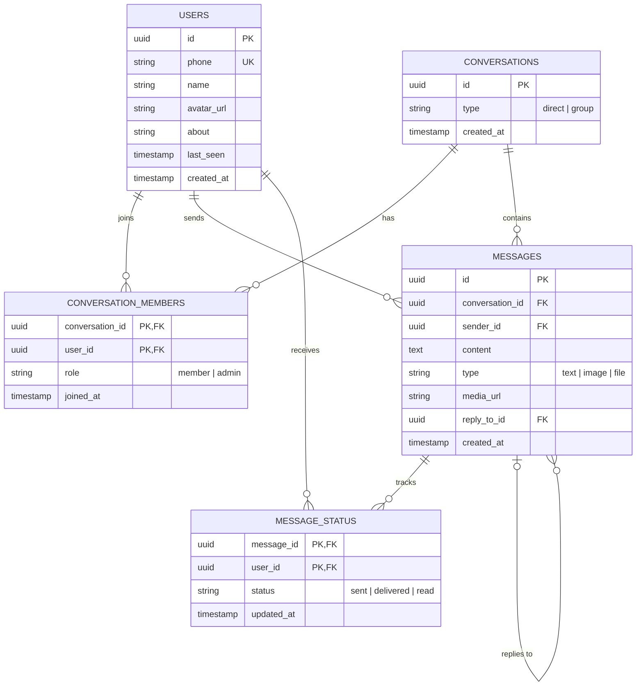

# Whatsapp-backend
## Database ER Diagram

```mermaid
erDiagram
    USERS ||--o{ CONVERSATION_MEMBERS : "joins"
    CONVERSATIONS ||--o{ CONVERSATION_MEMBERS : "has"
    CONVERSATIONS ||--o{ MESSAGES : "contains"
    USERS ||--o{ MESSAGES : "sends"
    MESSAGES ||--o{ MESSAGE_STATUS : "tracks"
    USERS ||--o{ MESSAGE_STATUS : "receives"
    MESSAGES |o--o{ MESSAGES : "replies to"

    USERS {
        uuid id PK
        string phone UK
        string name
        string avatar_url
        string about
        timestamp last_seen
        timestamp created_at
    }

    CONVERSATIONS {
        uuid id PK
        string type "direct | group"
        timestamp created_at
    }

    CONVERSATION_MEMBERS {
        uuid conversation_id PK, FK
        uuid user_id PK, FK
        string role "member | admin"
        timestamp joined_at
    }

    MESSAGES {
        uuid id PK
        uuid conversation_id FK
        uuid sender_id FK
        text content
        string type "text | image | file"
        string media_url
        uuid reply_to_id FK
        timestamp created_at
    }

    MESSAGE_STATUS {
        uuid message_id PK, FK
        uuid user_id PK, FK
        string status "sent | delivered | read"
        timestamp updated_at
    }
```