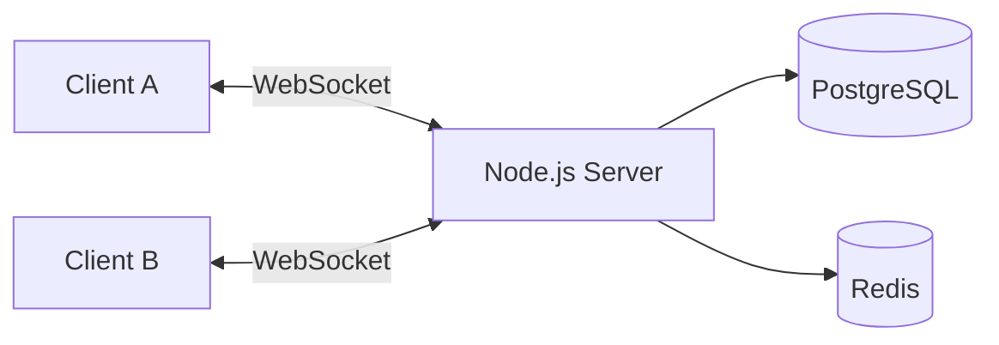
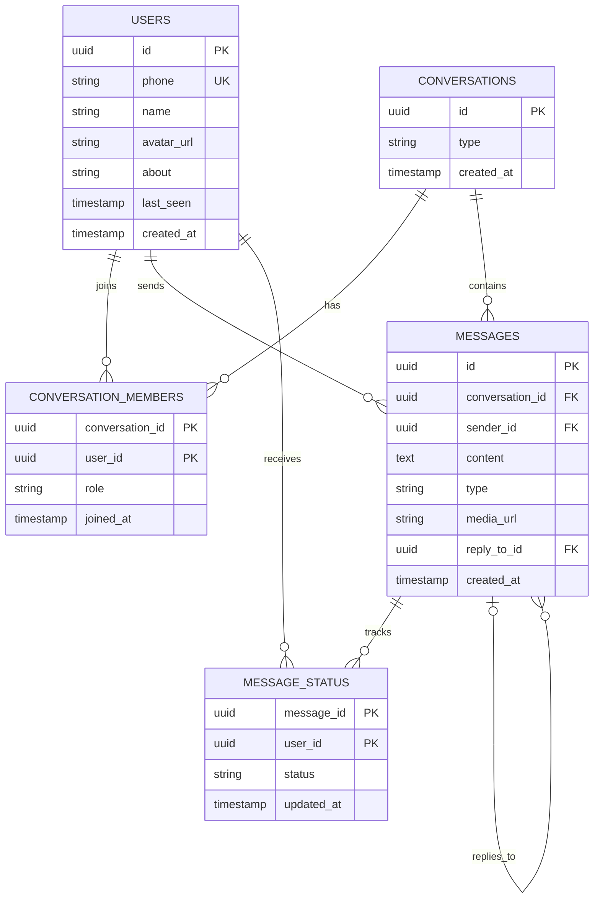

# Whatsapp-backend

A real-time chat backend inspired by WhatsApp, built with Node.js, Express, Socket.IO and PostgreSQL.

## Features

- [ ] User registration and login (JWT)
- [ ] One-to-one real-time chat
- [ ] Message history with pagination
- [ ] Message status (sent, delivered, read)
- [ ] Online / last seen
- [ ] Group chats
- [ ] Media sharing
- [ ] Typing indicators and push notifications

## Tech Stack

| Part | Technology |
|---|---|
| Server | Node.js, Express |
| Real-time | Socket.IO (WebSockets) |
| Database | PostgreSQL |
| Cache / presence | Redis |
| Auth | JWT, bcrypt |
| Deployment | Docker |

## Architecture



## Database ER Diagram



## API Endpoints

| Method | Endpoint | Description |
|---|---|---|
| POST | `/auth/register` | Create account |
| POST | `/auth/login` | Login and get JWT |
| GET | `/users/me` | Current user profile |
| GET | `/conversations` | List conversations |
| POST | `/conversations` | Create direct or group chat |
| GET | `/conversations/:id/messages` | Message history |

## WebSocket Events

- Client to server: `message:send`, `message:read`, `typing:start`, `typing:stop`
- Server to client: `message:new`, `message:status`, `typing`, `presence:update`

## Getting Started

```bash
git clone https://github.com/<your-username>/Whatsapp-backend.git
cd Whatsapp-backend
npm install
cp .env.example .env
npm run dev
```

Server runs at `http://localhost:5000`. Check `http://localhost:5000/health`.

## Folder Structure

```
src/
├── config/
├── models/
├── routes/
├── controllers/
├── services/
├── sockets/
├── middleware/
└── utils/
```

## Contributing

1. Fork the repo or create a branch: `git checkout -b feature/your-feature`
2. Commit your changes: `git commit -m "feat: your message"`
3. Push and open a Pull Request

## License

MIT
